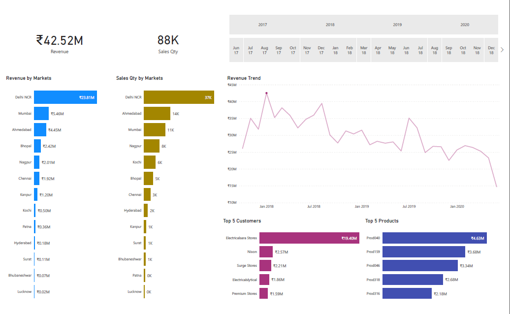
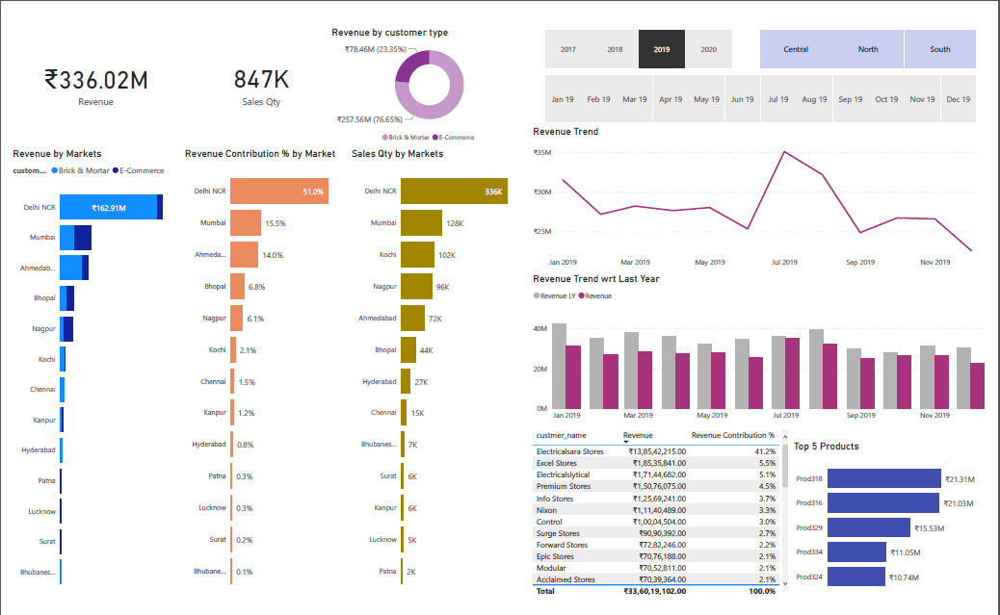
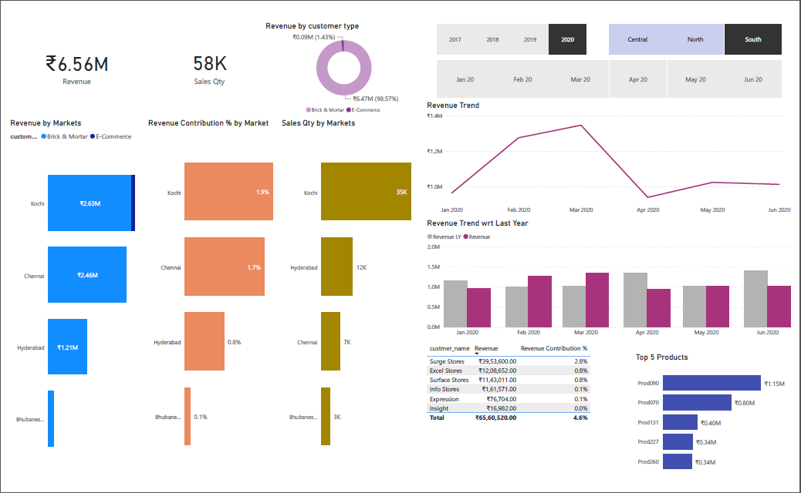
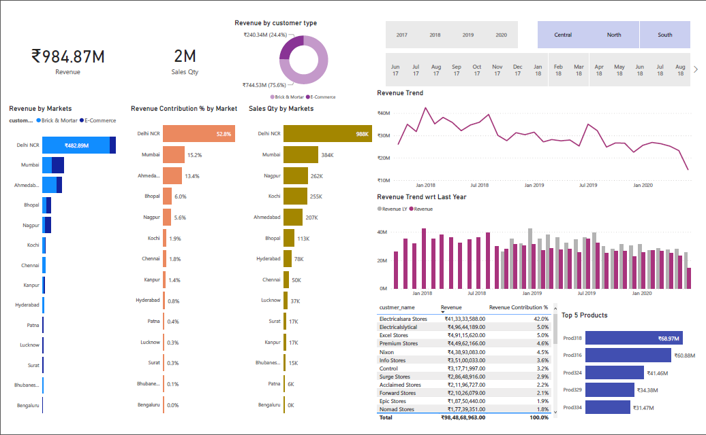

# Data Analysis Power BI Dashboard for Sales Insights
A Sales Insights dashboard built using Power BI.

## Procedure:
- Import the SQL database dump from the `db_dump.sql` file into MySQL database.
- Load the data from MySQL database to Power BI.

### Version 1:

Performed ETL (Extract, Transform, Load) on this data:

1) Filtered data in markets table where zones were blank.
2) Filtered data sales transactions table where sales_amount is less than equal to 0.
3) Normalized currency for sales_amount value from USD to INR by adding a new column 'norm_sales_amount' of data type 'Decimal number'.
4) Clean up currency 'INR' and 'INR\r' with duplicate values.

### Version 2:

- Added filters for zones on the dashboard.
- Added revenue contribution percentage by market.
- Transformed top 5 customers into a table visualization of all customers that can be sorted based on revenue generated and revenue contribution percentage.
- Added customer type (brick and mortar or ecommerce) to the Revenue by markets visualization.
- Added revenue by customer type donut chart.
- Added a bar graph visualization for revenue trend compared to last year.

### Sales Insights for year 2019:

### Sales Insights for South zone in the year 2020:

### Inferences:

- The revenue and sales are steadily declining.
- South zone is generating the least amount of revenue with Bangalore and Bhubaneshwar generating less than 1 million INR each.
- Delhi NCR generates more than 50% of the total revenue.
- In 2020, Bhopal dropped to 5th place from 4th place in terms of revenue generation in comparison to 2019 whereas Patna's revenue contribution has increased from 0.3% in 2019 to 0.6% in 2020.
- Electricalsara Stores is the top customer with respect to revenue generation.
- Delhi NCR, Mumbai and Ahmedabad are the top 3 markets by revenue.
- Delhi NCR, Mumbai Nagpur and Kochi are the top 4 markets by sales quantity.
- Prod318 is the top selling product and has generated 69.97 million in revenue till June 2020.

### Sales Insights from 2017 to 2020:

